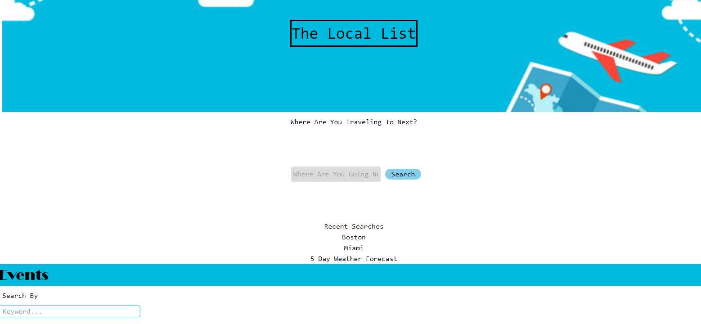

## Vandy-Project-01

## Description

The Local List repository allows the user to search by any city, once the search button is hit, the user will be presented with the a 5 day forecast as well as all the live events that are happening in the city of choice.

The goal of this project is to:

- Create a dynamic webpage displaying the current weather
- Use a weather API to find weather from the inputted city
- Display the search results from local storage to the webpage
- Use Ticketmaster API to showcase live events that are taking place
- Incorporate a CSS framework(Tailwind) for styling

The motivation is to create a functional dashboard for users to find events for cities they are visiting or living in and too see a snapshot of the weather forecast to help users make the best decision on which event to attend.
## Installation

To use project locally, follow these steps:

1. Clone repository to local machine 
    - git clone https://github.com/RPMcQuigg/Vandy-Project-01

2. Open 'index.html' in your web browser 

3. Click on input text area and enter a city

4. Once the search button is hit, the searched cities  five day forecast will display as well as a list of live events in the area.

## Usage

1. See below for snap shot of work day scheduler 
Image

2. Follow deployed link for full access
[The Local List](https://rpmcquigg.github.io/Vandy-Project-01/)